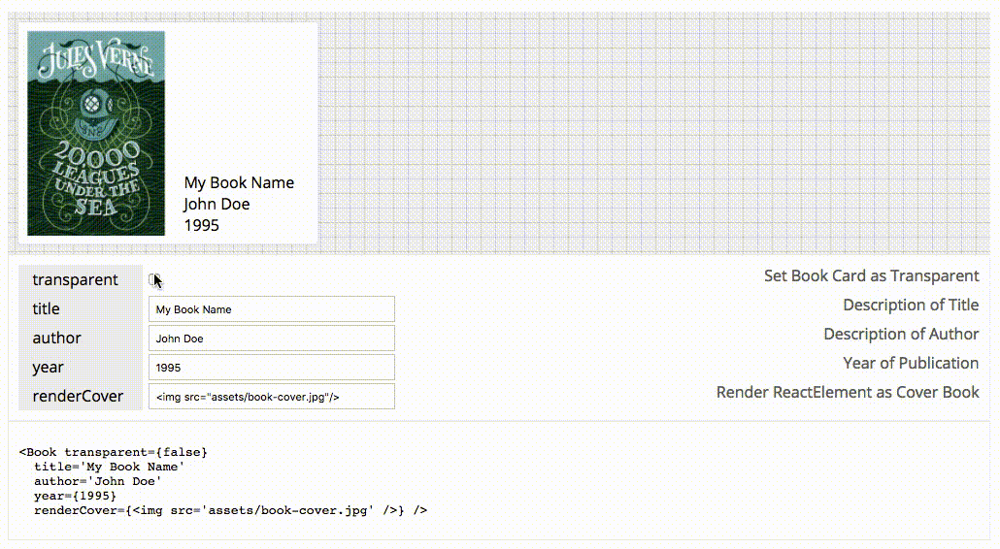

# reactsandbox

[](https://circleci.com/gh/raphamorim/reactsandbox/tree/master)

> Create a React Component Sandbox based on compositions

Integrate Live documentation on real-world React components. 

Reasons to use `reactsandbox`:

- Fully Hackable (you can create change everthing to your own style, see [available CSS classes](https://github.com/raphamorim/reactsandbox/blob/master/styles/reactsandbox.css))

- You can use with any Builder (Webpack, Rollup, Browserify, Parcel...). Since `reactsanbox` is only a HOC.

- Lightweight



## Installing

```bash
yarn add reactsandbox
```

## Example

**Book.js**

```jsx
import React from 'react'
import withSandbox, { Types } from 'reactsandbox'

const Book = ({title, author, year, transparent, renderCover}) =>
  <div className={`book ${(transparent)? 'transparent' : ''}`}>
    <div className='cover'>{renderCover}</div>
    <div className='info'>
      <div className='title'>{title}</div>
      <div className='author'>{author}</div>
      <div className='year'>{year}</div>
    </div>
  </div>

const BookSandbox = withSandbox(Book, {
  transparent: Types.Boolean(false, 'Set Book Card as Transparent'),
  title: Types.String('My Book Name', 'Description of Title'),
  author: Types.String('John Doe', 'Description of Author'),
  year: Types.Number(1995, 'Year of Publication'),
  renderCover: Types.ReactElement('', 'Render ReactElement as Cover Book')
})

export default Book
export BookSandbox
```

## Types

#### Boolean

#### String

#### Number

#### ReactElement

## Run the Example:

```sh

```
